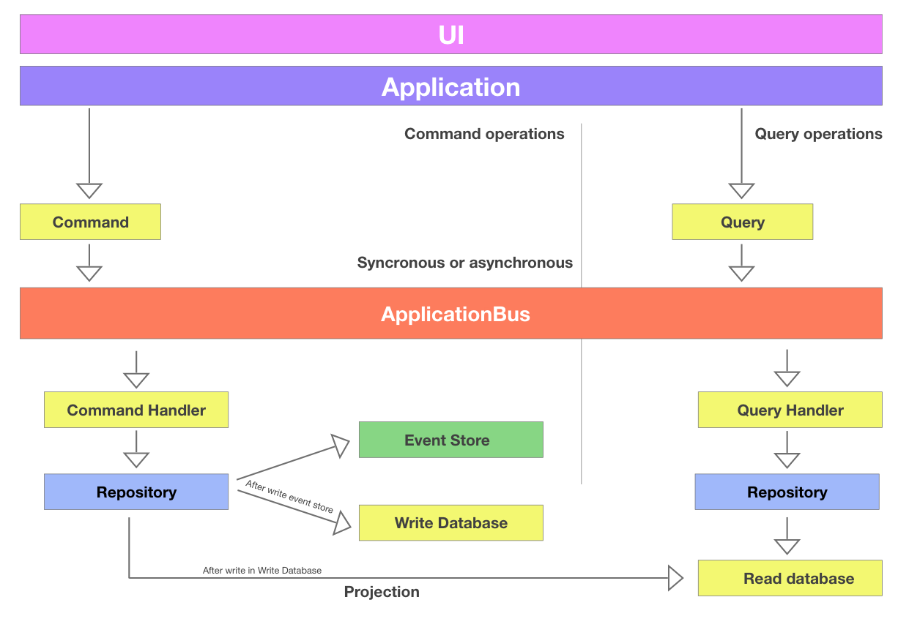

# A Microservice boilerplate using CQRS + Event Sourcing
[](https://travis-ci.org/robisson/php-microservice-cqrs-es)
[](https://coveralls.io/github/robisson/php-microservice-cqrs-es?branch=master)

This is a very simple example application with two endpoints, where it is simulated the creation of a project that has a name attribute and the listing of all registered projects.

**Built with:**
- Docker
- PHP 7.3
- Zend expressive
- Eloquent ORM
- Swagger-PHP

## Getting Started

Start your project with composer:

```bash
$ cd docker
$ docker-compose up -d
```

After build image and run container with docker composer

```bash
$ composer install
$ composer run --timeout=0 serve
```

## Tasks defined in composer

- `composer install` - Install all dependencies of the project
- `composer check` - Run the task that to validate PSR-2 and tests
- `composer cs-check` - Validate the PSR-2 code indent
- `composer fix` - Fix code indent to the PSR-2
- `composer serve` - Run built-in server
- `composer test` - Run tests
- `composer test-coverage` - Run the code coverage report
- `composer docs` - Generate api documention based on OpenAPI with Swagger-PHP

## Workflow application
